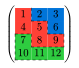

# Pavemat

<div style="text-align: center">
  
  <p><strong> pavement + matrix </strong></p>
</div>

## Introduction

The pavemat is a versatile tool for creating styled matrices with custom paths, strokes, and fills. It allows users to define how paths should be drawn through the matrix, apply different strokes to these paths, and fill specific cells with various colors. This function is particularly useful for visualizing complex data structures, mathematical matrices, and creating custom grid layouts.

## Key Features

- Custom Paths: Define paths through the matrix using directional characters.
- Stroke Styles: Customize the appearance of path lines with different dash patterns, thicknesses, and colors.
- Cell Fills: Fill specific cells with colors, making certain parts of the matrix stand out.
- Custom Direction Characters: Override default directional characters to suit different notations.
- Debug Mode: Visualize hidden lines and debug the path layout.

## Examples

The logo example:

```typst
#set math.mat(row-gap: 0.25em, column-gap: 0.1em)
#set text(size: 2em)

#pavemat(
  pave: ("SDS(dash: 'solid')DDD]WW", (path: "sdDDD", stroke: aqua.darken(30%))),
  fills: (
    "0-0": green.transparentize(80%),
    "1-1": blue.transparentize(80%),
    "[0-0]": green.transparentize(60%),
    "[1-1]": blue.transparentize(60%),
  ),
)[$mat(P, a, v, e; "", m, a, t)$]
```

More examples can be found in `examples/examples.typ`.




## Manual

See `docs/manual.typ`.
